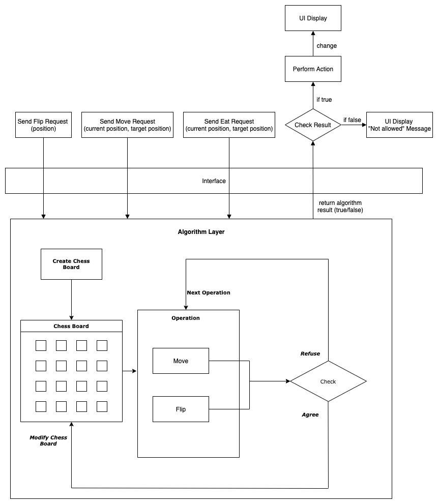

# CSE230FA21PJ-Proposal
Team members:
Zhenya Ma, 
Hongkai Chen, 
Junchen Bao, 
Haozhe Luo

We are planning to create a two-player board game called “beast chess.” We will create a user interface using Haskell to display a chessboard and all the chess. The chessboard will be 4 times 4 checkboard. Initially, all the 16 chess (8 red chess and 8 blue chess) will be put on the chessboard upside down. Each player will be holding either the red side or the blue side. The player who holds the red side will start to flip chess. Players take turns to make a move, each round each player must make exactly one move. A move is defined as either flipping upside-down chess, or moving chess from the player’s side in one of the four directions: up, down, left, and right. While moving chess, the player can either move the chess to a blank spot (a spot on the chessboard which is not occupied by any other chess) or eat the opponent chess with a weaker beast. The value of the beast is elephant > lion > tiger > cheetah > dog > cat > rat > ant. However, both rat and ant can eat elephant. If the same beast from two sides meets, whichever initiates the attack eats the other. A weaker beast is not allowed to suicide by a walk into a stronger beast’s spot and getting taken over. We will make a timer that counts down and limits the time each player takes to make a move. We will also prompt the user to move. Our program should detect legal and illegal moves and decide who wins the game (or draw). The initial layout of all the upside-down chess should be created by the program randomly. We will make our program enforce the game logic, and easy for users to use.

## Milestone #2: Updates
### What is the architecture of your application (the key components)?
We mainly have the algorithm implementation and UI parts. They will interact with each other through some interface.
The following picture shows the architecture:

### What challenges (if any) did you have so far and how did you solve them?
- Challenge1: How to collobrate in such a complex project? 
- Method: At first we find this project will be a little complex with some UI demmand. We solve this problem by carefully design the system architecture and the interaction interface between each part. After that, we divide the four teammates into two part.

- Challenge2: It will be pretty hard to build interactive GUI with Haskell.
- Method: Just a simple UI will be easy, but this system needs to interact with human. So we are planning to study some sample Haskell examples with interactive UI.

- Challenge3: How to write a project instead of just one single file?
- Method: In previous homework, we mainly just fill some functions in the single file. This will be the first time we will build a complex project from the beginning. We will study how the past homework organize the project files.

- Challenge4： Not familiar with Brick library and unit test in Haskell.
- Method: We plan to read some documentation and tutorial from the website.

### Do you expect to meet your goals until the deadline? If not, how will you modify your goals?
Though we are faced with some problems and difficulties, we have confidence to finish the project by Dec10.
